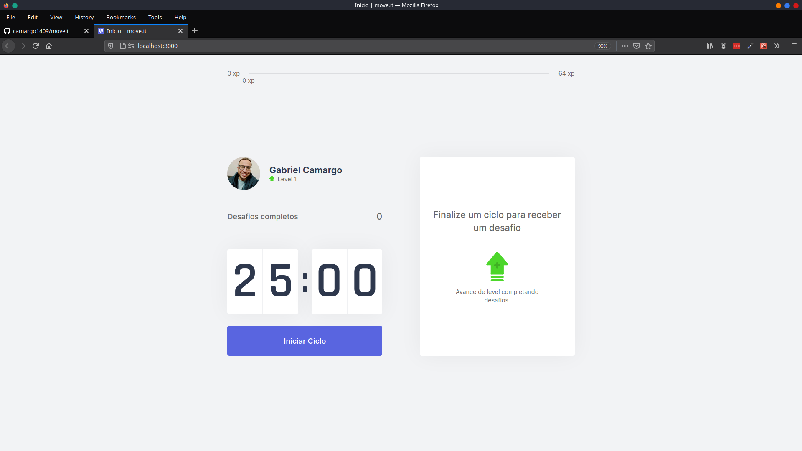

  

<h4 align="center">
  🚀 Move.it
</h4>

 

  

  <a href="#computer-tecnologias">Tecnologias</a>&nbsp;&nbsp;&nbsp;|&nbsp;&nbsp;&nbsp;
  <a href="#gear-projeto">Projeto</a>&nbsp;&nbsp;&nbsp;|&nbsp;&nbsp;&nbsp;
  <a href="#layout">Layout</a>&nbsp;&nbsp;&nbsp;|&nbsp;&nbsp;&nbsp;
  <a href="#thinking-como-contribuir">Como contribuir</a>&nbsp;&nbsp;&nbsp;

 

## :computer: Tecnologias

Esse projeto foi desenvolvido com as seguintes tecnologias:

- [React Js](https://reactjs.org)
- [Next Js](https://nextjs.org)

## :gear: Projeto
O move.it foi desenvolvido durante um evento da Rocketseat chamado Next Level Week. O intuito dele é funcionar como um relógio de pomodoro, onde se tem ciclos de tempo para realizar determinadas atividades e ao fim de cada ciclo dar uma pausa. A ideia do move.it é lançar alguns desafios para programadores para exercitar o corpo e os olhos durante essas pausas, visto que nós programadores passamos muito tempo em frente ao computador, realizando poucos movimentos e cansando visão.

## Layout

  
 

## :thinking: Como contribuir

- Faça um fork desse repositório;
- Cria uma branch com a sua feature: `git checkout -b minha-feature`;
- Faça commit das suas alterações: `git commit -m 'feat: Minha nova feature'`;
- Faça push para a sua branch: `git push origin minha-feature`.

Depois que o merge da sua pull request for feito, você pode deletar a sua branch.

Feito com ♥ by Gabriel Camargo :wave:
